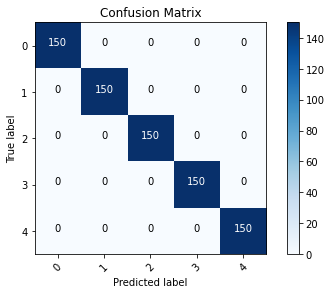

```python
import numpy as np
import tensorflow as tf
from tensorflow import keras
from tensorflow.keras.layers import Dense, Activation
from tensorflow.keras.optimizers import Adam
from tensorflow.keras.metrics import categorical_crossentropy
from tensorflow.keras.preprocessing.image import ImageDataGenerator
from tensorflow.keras.preprocessing import image
from tensorflow.keras.models import Model
from tensorflow.keras.applications import imagenet_utils
from sklearn.metrics import confusion_matrix
import itertools
import os
import shutil
import random
import matplotlib.pyplot as plt
%matplotlib inline
```


```python
physical_devices = tf.config.experimental.list_physical_devices('GPU')
print("Num GPUs Available: ", len(physical_devices))
tf.config.experimental.set_memory_growth(physical_devices[0], True)
```

    Num GPUs Available:  1
    

# Data augmentation


```python
gen = ImageDataGenerator(rotation_range=10, width_shift_range=0.1, height_shift_range=0.1, shear_range=0.15, zoom_range=0.1, 
    channel_shift_range=10., horizontal_flip=True)
```


```python
os.chdir('/Documents/data/flower-photos/')

dirs = os.listdir()

for dir in dirs:
    images = os.listdir(dir)
    for image in images:
        image_path = '/Documents/data/flower-photos/'+dir+'/'+image
        # Obtain image by reading the image from disk
        image = np.expand_dims(plt.imread(image_path),0)
        # Generate and save batches of augmented images from the original image
        aug_iter = gen.flow(image, save_to_dir='/Documents/data/flower-photos/'+dir, save_prefix='aug-', save_format='jpeg')
        aug_images = [next(aug_iter)[0].astype(np.uint8) for i in range(10)]
        
    print(dir)
```

    daisy
    dandelion
    roses
    sunflowers
    tulips
    

# Image preparation


```python
def plot_confusion_matrix(cm, classes,
                          normalize=False,
                          title='Confusion matrix',
                          cmap=plt.cm.Blues):
    """
    This function prints and plots the confusion matrix.
    Normalization can be applied by setting `normalize=True`.
    """
    plt.imshow(cm, interpolation='nearest', cmap=cmap)
    plt.title(title)
    plt.colorbar()
    tick_marks = np.arange(len(classes))
    plt.xticks(tick_marks, classes, rotation=45)
    plt.yticks(tick_marks, classes)

    if normalize:
        cm = cm.astype('float') / cm.sum(axis=1)[:, np.newaxis]
        print("Normalized confusion matrix")
    else:
        print('Confusion matrix, without normalization')

    print(cm)

    thresh = cm.max() / 2.
    for i, j in itertools.product(range(cm.shape[0]), range(cm.shape[1])):
        plt.text(j, i, cm[i, j],
            horizontalalignment="center",
            color="white" if cm[i, j] > thresh else "black")

    plt.tight_layout()
    plt.ylabel('True label')
    plt.xlabel('Predicted label')
```


```python
# Organize data into train, valid, test dirs
os.chdir('/Documents/data/flower-photos')

dirs = os.listdir()

if os.path.isdir('train/daisy/') is False: 
    os.mkdir('train')
    os.mkdir('valid')
    os.mkdir('test')
    
    for dir in dirs:
        if dir != 'train' and dir != 'test' and dir != 'valid':
            shutil.move(dir, 'train')
            os.mkdir(f'valid/{dir}')
            os.mkdir(f'test/{dir}')
              
            valid_samples = random.sample(os.listdir(f'train/{dir}'), 500)
            for j in valid_samples:
                shutil.move(f'train/{dir}/{j}', f'valid/{dir}')

            test_samples = random.sample(os.listdir(f'train/{dir}'), 150)
            for k in test_samples:
                shutil.move(f'train/{dir}/{k}', f'test/{dir}')
os.chdir('../..')
```


```python
os.chdir('/Documents/')

train_path = 'data/flower-photos/train'
valid_path = 'data/flower-photos/valid'
test_path = 'data/flower-photos/test'
```


```python
train_batches = ImageDataGenerator(preprocessing_function=tf.keras.applications.mobilenet.preprocess_input).flow_from_directory(
    directory=train_path, target_size=(224,224), batch_size=75)
valid_batches = ImageDataGenerator(preprocessing_function=tf.keras.applications.mobilenet.preprocess_input).flow_from_directory(
    directory=valid_path, target_size=(224,224), batch_size=10)
test_batches = ImageDataGenerator(preprocessing_function=tf.keras.applications.mobilenet.preprocess_input).flow_from_directory(
    directory=test_path, target_size=(224,224), batch_size=10, shuffle=False)
```

    Found 26345 images belonging to 5 classes.
    Found 2500 images belonging to 5 classes.
    Found 750 images belonging to 5 classes.
    

# Modify model


```python
mobile = tf.keras.applications.mobilenet.MobileNet()
mobile.summary()
```

    Model: "mobilenet_1.00_224"
    _________________________________________________________________
    Layer (type)                 Output Shape              Param #   
    =================================================================
    input_3 (InputLayer)         [(None, 224, 224, 3)]     0         
    _________________________________________________________________
    conv1 (Conv2D)               (None, 112, 112, 32)      864       
    _________________________________________________________________
    conv1_bn (BatchNormalization (None, 112, 112, 32)      128       
    _________________________________________________________________
    conv1_relu (ReLU)            (None, 112, 112, 32)      0         
    _________________________________________________________________
    conv_dw_1 (DepthwiseConv2D)  (None, 112, 112, 32)      288       
    _________________________________________________________________
    conv_dw_1_bn (BatchNormaliza (None, 112, 112, 32)      128       
    _________________________________________________________________
    conv_dw_1_relu (ReLU)        (None, 112, 112, 32)      0         
    _________________________________________________________________
    conv_pw_1 (Conv2D)           (None, 112, 112, 64)      2048      
    _________________________________________________________________
    conv_pw_1_bn (BatchNormaliza (None, 112, 112, 64)      256       
    _________________________________________________________________
    conv_pw_1_relu (ReLU)        (None, 112, 112, 64)      0         
    _________________________________________________________________
    conv_pad_2 (ZeroPadding2D)   (None, 113, 113, 64)      0         
    _________________________________________________________________
    conv_dw_2 (DepthwiseConv2D)  (None, 56, 56, 64)        576       
    _________________________________________________________________
    conv_dw_2_bn (BatchNormaliza (None, 56, 56, 64)        256       
    _________________________________________________________________
    conv_dw_2_relu (ReLU)        (None, 56, 56, 64)        0         
    _________________________________________________________________
    conv_pw_2 (Conv2D)           (None, 56, 56, 128)       8192      
    _________________________________________________________________
    conv_pw_2_bn (BatchNormaliza (None, 56, 56, 128)       512       
    _________________________________________________________________
    conv_pw_2_relu (ReLU)        (None, 56, 56, 128)       0         
    _________________________________________________________________
    conv_dw_3 (DepthwiseConv2D)  (None, 56, 56, 128)       1152      
    _________________________________________________________________
    conv_dw_3_bn (BatchNormaliza (None, 56, 56, 128)       512       
    _________________________________________________________________
    conv_dw_3_relu (ReLU)        (None, 56, 56, 128)       0         
    _________________________________________________________________
    conv_pw_3 (Conv2D)           (None, 56, 56, 128)       16384     
    _________________________________________________________________
    conv_pw_3_bn (BatchNormaliza (None, 56, 56, 128)       512       
    _________________________________________________________________
    conv_pw_3_relu (ReLU)        (None, 56, 56, 128)       0         
    _________________________________________________________________
    conv_pad_4 (ZeroPadding2D)   (None, 57, 57, 128)       0         
    _________________________________________________________________
    conv_dw_4 (DepthwiseConv2D)  (None, 28, 28, 128)       1152      
    _________________________________________________________________
    conv_dw_4_bn (BatchNormaliza (None, 28, 28, 128)       512       
    _________________________________________________________________
    conv_dw_4_relu (ReLU)        (None, 28, 28, 128)       0         
    _________________________________________________________________
    conv_pw_4 (Conv2D)           (None, 28, 28, 256)       32768     
    _________________________________________________________________
    conv_pw_4_bn (BatchNormaliza (None, 28, 28, 256)       1024      
    _________________________________________________________________
    conv_pw_4_relu (ReLU)        (None, 28, 28, 256)       0         
    _________________________________________________________________
    conv_dw_5 (DepthwiseConv2D)  (None, 28, 28, 256)       2304      
    _________________________________________________________________
    conv_dw_5_bn (BatchNormaliza (None, 28, 28, 256)       1024      
    _________________________________________________________________
    conv_dw_5_relu (ReLU)        (None, 28, 28, 256)       0         
    _________________________________________________________________
    conv_pw_5 (Conv2D)           (None, 28, 28, 256)       65536     
    _________________________________________________________________
    conv_pw_5_bn (BatchNormaliza (None, 28, 28, 256)       1024      
    _________________________________________________________________
    conv_pw_5_relu (ReLU)        (None, 28, 28, 256)       0         
    _________________________________________________________________
    conv_pad_6 (ZeroPadding2D)   (None, 29, 29, 256)       0         
    _________________________________________________________________
    conv_dw_6 (DepthwiseConv2D)  (None, 14, 14, 256)       2304      
    _________________________________________________________________
    conv_dw_6_bn (BatchNormaliza (None, 14, 14, 256)       1024      
    _________________________________________________________________
    conv_dw_6_relu (ReLU)        (None, 14, 14, 256)       0         
    _________________________________________________________________
    conv_pw_6 (Conv2D)           (None, 14, 14, 512)       131072    
    _________________________________________________________________
    conv_pw_6_bn (BatchNormaliza (None, 14, 14, 512)       2048      
    _________________________________________________________________
    conv_pw_6_relu (ReLU)        (None, 14, 14, 512)       0         
    _________________________________________________________________
    conv_dw_7 (DepthwiseConv2D)  (None, 14, 14, 512)       4608      
    _________________________________________________________________
    conv_dw_7_bn (BatchNormaliza (None, 14, 14, 512)       2048      
    _________________________________________________________________
    conv_dw_7_relu (ReLU)        (None, 14, 14, 512)       0         
    _________________________________________________________________
    conv_pw_7 (Conv2D)           (None, 14, 14, 512)       262144    
    _________________________________________________________________
    conv_pw_7_bn (BatchNormaliza (None, 14, 14, 512)       2048      
    _________________________________________________________________
    conv_pw_7_relu (ReLU)        (None, 14, 14, 512)       0         
    _________________________________________________________________
    conv_dw_8 (DepthwiseConv2D)  (None, 14, 14, 512)       4608      
    _________________________________________________________________
    conv_dw_8_bn (BatchNormaliza (None, 14, 14, 512)       2048      
    _________________________________________________________________
    conv_dw_8_relu (ReLU)        (None, 14, 14, 512)       0         
    _________________________________________________________________
    conv_pw_8 (Conv2D)           (None, 14, 14, 512)       262144    
    _________________________________________________________________
    conv_pw_8_bn (BatchNormaliza (None, 14, 14, 512)       2048      
    _________________________________________________________________
    conv_pw_8_relu (ReLU)        (None, 14, 14, 512)       0         
    _________________________________________________________________
    conv_dw_9 (DepthwiseConv2D)  (None, 14, 14, 512)       4608      
    _________________________________________________________________
    conv_dw_9_bn (BatchNormaliza (None, 14, 14, 512)       2048      
    _________________________________________________________________
    conv_dw_9_relu (ReLU)        (None, 14, 14, 512)       0         
    _________________________________________________________________
    conv_pw_9 (Conv2D)           (None, 14, 14, 512)       262144    
    _________________________________________________________________
    conv_pw_9_bn (BatchNormaliza (None, 14, 14, 512)       2048      
    _________________________________________________________________
    conv_pw_9_relu (ReLU)        (None, 14, 14, 512)       0         
    _________________________________________________________________
    conv_dw_10 (DepthwiseConv2D) (None, 14, 14, 512)       4608      
    _________________________________________________________________
    conv_dw_10_bn (BatchNormaliz (None, 14, 14, 512)       2048      
    _________________________________________________________________
    conv_dw_10_relu (ReLU)       (None, 14, 14, 512)       0         
    _________________________________________________________________
    conv_pw_10 (Conv2D)          (None, 14, 14, 512)       262144    
    _________________________________________________________________
    conv_pw_10_bn (BatchNormaliz (None, 14, 14, 512)       2048      
    _________________________________________________________________
    conv_pw_10_relu (ReLU)       (None, 14, 14, 512)       0         
    _________________________________________________________________
    conv_dw_11 (DepthwiseConv2D) (None, 14, 14, 512)       4608      
    _________________________________________________________________
    conv_dw_11_bn (BatchNormaliz (None, 14, 14, 512)       2048      
    _________________________________________________________________
    conv_dw_11_relu (ReLU)       (None, 14, 14, 512)       0         
    _________________________________________________________________
    conv_pw_11 (Conv2D)          (None, 14, 14, 512)       262144    
    _________________________________________________________________
    conv_pw_11_bn (BatchNormaliz (None, 14, 14, 512)       2048      
    _________________________________________________________________
    conv_pw_11_relu (ReLU)       (None, 14, 14, 512)       0         
    _________________________________________________________________
    conv_pad_12 (ZeroPadding2D)  (None, 15, 15, 512)       0         
    _________________________________________________________________
    conv_dw_12 (DepthwiseConv2D) (None, 7, 7, 512)         4608      
    _________________________________________________________________
    conv_dw_12_bn (BatchNormaliz (None, 7, 7, 512)         2048      
    _________________________________________________________________
    conv_dw_12_relu (ReLU)       (None, 7, 7, 512)         0         
    _________________________________________________________________
    conv_pw_12 (Conv2D)          (None, 7, 7, 1024)        524288    
    _________________________________________________________________
    conv_pw_12_bn (BatchNormaliz (None, 7, 7, 1024)        4096      
    _________________________________________________________________
    conv_pw_12_relu (ReLU)       (None, 7, 7, 1024)        0         
    _________________________________________________________________
    conv_dw_13 (DepthwiseConv2D) (None, 7, 7, 1024)        9216      
    _________________________________________________________________
    conv_dw_13_bn (BatchNormaliz (None, 7, 7, 1024)        4096      
    _________________________________________________________________
    conv_dw_13_relu (ReLU)       (None, 7, 7, 1024)        0         
    _________________________________________________________________
    conv_pw_13 (Conv2D)          (None, 7, 7, 1024)        1048576   
    _________________________________________________________________
    conv_pw_13_bn (BatchNormaliz (None, 7, 7, 1024)        4096      
    _________________________________________________________________
    conv_pw_13_relu (ReLU)       (None, 7, 7, 1024)        0         
    _________________________________________________________________
    global_average_pooling2d_2 ( (None, 1024)              0         
    _________________________________________________________________
    reshape_1 (Reshape)          (None, 1, 1, 1024)        0         
    _________________________________________________________________
    dropout (Dropout)            (None, 1, 1, 1024)        0         
    _________________________________________________________________
    conv_preds (Conv2D)          (None, 1, 1, 1000)        1025000   
    _________________________________________________________________
    reshape_2 (Reshape)          (None, 1000)              0         
    _________________________________________________________________
    predictions (Activation)     (None, 1000)              0         
    =================================================================
    Total params: 4,253,864
    Trainable params: 4,231,976
    Non-trainable params: 21,888
    _________________________________________________________________
    


```python
x = mobile.layers[-6].output
output = Dense(units=5, activation='softmax')(x)
```


```python
model = Model(inputs=mobile.input, outputs=output)
```


```python
for layer in model.layers[:-28]:
    layer.trainable = False
```


```python
model.summary()
```

    Model: "model_2"
    _________________________________________________________________
    Layer (type)                 Output Shape              Param #   
    =================================================================
    input_3 (InputLayer)         [(None, 224, 224, 3)]     0         
    _________________________________________________________________
    conv1 (Conv2D)               (None, 112, 112, 32)      864       
    _________________________________________________________________
    conv1_bn (BatchNormalization (None, 112, 112, 32)      128       
    _________________________________________________________________
    conv1_relu (ReLU)            (None, 112, 112, 32)      0         
    _________________________________________________________________
    conv_dw_1 (DepthwiseConv2D)  (None, 112, 112, 32)      288       
    _________________________________________________________________
    conv_dw_1_bn (BatchNormaliza (None, 112, 112, 32)      128       
    _________________________________________________________________
    conv_dw_1_relu (ReLU)        (None, 112, 112, 32)      0         
    _________________________________________________________________
    conv_pw_1 (Conv2D)           (None, 112, 112, 64)      2048      
    _________________________________________________________________
    conv_pw_1_bn (BatchNormaliza (None, 112, 112, 64)      256       
    _________________________________________________________________
    conv_pw_1_relu (ReLU)        (None, 112, 112, 64)      0         
    _________________________________________________________________
    conv_pad_2 (ZeroPadding2D)   (None, 113, 113, 64)      0         
    _________________________________________________________________
    conv_dw_2 (DepthwiseConv2D)  (None, 56, 56, 64)        576       
    _________________________________________________________________
    conv_dw_2_bn (BatchNormaliza (None, 56, 56, 64)        256       
    _________________________________________________________________
    conv_dw_2_relu (ReLU)        (None, 56, 56, 64)        0         
    _________________________________________________________________
    conv_pw_2 (Conv2D)           (None, 56, 56, 128)       8192      
    _________________________________________________________________
    conv_pw_2_bn (BatchNormaliza (None, 56, 56, 128)       512       
    _________________________________________________________________
    conv_pw_2_relu (ReLU)        (None, 56, 56, 128)       0         
    _________________________________________________________________
    conv_dw_3 (DepthwiseConv2D)  (None, 56, 56, 128)       1152      
    _________________________________________________________________
    conv_dw_3_bn (BatchNormaliza (None, 56, 56, 128)       512       
    _________________________________________________________________
    conv_dw_3_relu (ReLU)        (None, 56, 56, 128)       0         
    _________________________________________________________________
    conv_pw_3 (Conv2D)           (None, 56, 56, 128)       16384     
    _________________________________________________________________
    conv_pw_3_bn (BatchNormaliza (None, 56, 56, 128)       512       
    _________________________________________________________________
    conv_pw_3_relu (ReLU)        (None, 56, 56, 128)       0         
    _________________________________________________________________
    conv_pad_4 (ZeroPadding2D)   (None, 57, 57, 128)       0         
    _________________________________________________________________
    conv_dw_4 (DepthwiseConv2D)  (None, 28, 28, 128)       1152      
    _________________________________________________________________
    conv_dw_4_bn (BatchNormaliza (None, 28, 28, 128)       512       
    _________________________________________________________________
    conv_dw_4_relu (ReLU)        (None, 28, 28, 128)       0         
    _________________________________________________________________
    conv_pw_4 (Conv2D)           (None, 28, 28, 256)       32768     
    _________________________________________________________________
    conv_pw_4_bn (BatchNormaliza (None, 28, 28, 256)       1024      
    _________________________________________________________________
    conv_pw_4_relu (ReLU)        (None, 28, 28, 256)       0         
    _________________________________________________________________
    conv_dw_5 (DepthwiseConv2D)  (None, 28, 28, 256)       2304      
    _________________________________________________________________
    conv_dw_5_bn (BatchNormaliza (None, 28, 28, 256)       1024      
    _________________________________________________________________
    conv_dw_5_relu (ReLU)        (None, 28, 28, 256)       0         
    _________________________________________________________________
    conv_pw_5 (Conv2D)           (None, 28, 28, 256)       65536     
    _________________________________________________________________
    conv_pw_5_bn (BatchNormaliza (None, 28, 28, 256)       1024      
    _________________________________________________________________
    conv_pw_5_relu (ReLU)        (None, 28, 28, 256)       0         
    _________________________________________________________________
    conv_pad_6 (ZeroPadding2D)   (None, 29, 29, 256)       0         
    _________________________________________________________________
    conv_dw_6 (DepthwiseConv2D)  (None, 14, 14, 256)       2304      
    _________________________________________________________________
    conv_dw_6_bn (BatchNormaliza (None, 14, 14, 256)       1024      
    _________________________________________________________________
    conv_dw_6_relu (ReLU)        (None, 14, 14, 256)       0         
    _________________________________________________________________
    conv_pw_6 (Conv2D)           (None, 14, 14, 512)       131072    
    _________________________________________________________________
    conv_pw_6_bn (BatchNormaliza (None, 14, 14, 512)       2048      
    _________________________________________________________________
    conv_pw_6_relu (ReLU)        (None, 14, 14, 512)       0         
    _________________________________________________________________
    conv_dw_7 (DepthwiseConv2D)  (None, 14, 14, 512)       4608      
    _________________________________________________________________
    conv_dw_7_bn (BatchNormaliza (None, 14, 14, 512)       2048      
    _________________________________________________________________
    conv_dw_7_relu (ReLU)        (None, 14, 14, 512)       0         
    _________________________________________________________________
    conv_pw_7 (Conv2D)           (None, 14, 14, 512)       262144    
    _________________________________________________________________
    conv_pw_7_bn (BatchNormaliza (None, 14, 14, 512)       2048      
    _________________________________________________________________
    conv_pw_7_relu (ReLU)        (None, 14, 14, 512)       0         
    _________________________________________________________________
    conv_dw_8 (DepthwiseConv2D)  (None, 14, 14, 512)       4608      
    _________________________________________________________________
    conv_dw_8_bn (BatchNormaliza (None, 14, 14, 512)       2048      
    _________________________________________________________________
    conv_dw_8_relu (ReLU)        (None, 14, 14, 512)       0         
    _________________________________________________________________
    conv_pw_8 (Conv2D)           (None, 14, 14, 512)       262144    
    _________________________________________________________________
    conv_pw_8_bn (BatchNormaliza (None, 14, 14, 512)       2048      
    _________________________________________________________________
    conv_pw_8_relu (ReLU)        (None, 14, 14, 512)       0         
    _________________________________________________________________
    conv_dw_9 (DepthwiseConv2D)  (None, 14, 14, 512)       4608      
    _________________________________________________________________
    conv_dw_9_bn (BatchNormaliza (None, 14, 14, 512)       2048      
    _________________________________________________________________
    conv_dw_9_relu (ReLU)        (None, 14, 14, 512)       0         
    _________________________________________________________________
    conv_pw_9 (Conv2D)           (None, 14, 14, 512)       262144    
    _________________________________________________________________
    conv_pw_9_bn (BatchNormaliza (None, 14, 14, 512)       2048      
    _________________________________________________________________
    conv_pw_9_relu (ReLU)        (None, 14, 14, 512)       0         
    _________________________________________________________________
    conv_dw_10 (DepthwiseConv2D) (None, 14, 14, 512)       4608      
    _________________________________________________________________
    conv_dw_10_bn (BatchNormaliz (None, 14, 14, 512)       2048      
    _________________________________________________________________
    conv_dw_10_relu (ReLU)       (None, 14, 14, 512)       0         
    _________________________________________________________________
    conv_pw_10 (Conv2D)          (None, 14, 14, 512)       262144    
    _________________________________________________________________
    conv_pw_10_bn (BatchNormaliz (None, 14, 14, 512)       2048      
    _________________________________________________________________
    conv_pw_10_relu (ReLU)       (None, 14, 14, 512)       0         
    _________________________________________________________________
    conv_dw_11 (DepthwiseConv2D) (None, 14, 14, 512)       4608      
    _________________________________________________________________
    conv_dw_11_bn (BatchNormaliz (None, 14, 14, 512)       2048      
    _________________________________________________________________
    conv_dw_11_relu (ReLU)       (None, 14, 14, 512)       0         
    _________________________________________________________________
    conv_pw_11 (Conv2D)          (None, 14, 14, 512)       262144    
    _________________________________________________________________
    conv_pw_11_bn (BatchNormaliz (None, 14, 14, 512)       2048      
    _________________________________________________________________
    conv_pw_11_relu (ReLU)       (None, 14, 14, 512)       0         
    _________________________________________________________________
    conv_pad_12 (ZeroPadding2D)  (None, 15, 15, 512)       0         
    _________________________________________________________________
    conv_dw_12 (DepthwiseConv2D) (None, 7, 7, 512)         4608      
    _________________________________________________________________
    conv_dw_12_bn (BatchNormaliz (None, 7, 7, 512)         2048      
    _________________________________________________________________
    conv_dw_12_relu (ReLU)       (None, 7, 7, 512)         0         
    _________________________________________________________________
    conv_pw_12 (Conv2D)          (None, 7, 7, 1024)        524288    
    _________________________________________________________________
    conv_pw_12_bn (BatchNormaliz (None, 7, 7, 1024)        4096      
    _________________________________________________________________
    conv_pw_12_relu (ReLU)       (None, 7, 7, 1024)        0         
    _________________________________________________________________
    conv_dw_13 (DepthwiseConv2D) (None, 7, 7, 1024)        9216      
    _________________________________________________________________
    conv_dw_13_bn (BatchNormaliz (None, 7, 7, 1024)        4096      
    _________________________________________________________________
    conv_dw_13_relu (ReLU)       (None, 7, 7, 1024)        0         
    _________________________________________________________________
    conv_pw_13 (Conv2D)          (None, 7, 7, 1024)        1048576   
    _________________________________________________________________
    conv_pw_13_bn (BatchNormaliz (None, 7, 7, 1024)        4096      
    _________________________________________________________________
    conv_pw_13_relu (ReLU)       (None, 7, 7, 1024)        0         
    _________________________________________________________________
    global_average_pooling2d_2 ( (None, 1024)              0         
    _________________________________________________________________
    dense_2 (Dense)              (None, 5)                 5125      
    =================================================================
    Total params: 3,233,989
    Trainable params: 2,136,581
    Non-trainable params: 1,097,408
    _________________________________________________________________
    

# Train model


```python
model.compile(optimizer=Adam(lr=0.0001), loss='categorical_crossentropy', metrics=['accuracy']) 
```


```python
model.fit(x=train_batches,
            steps_per_epoch=len(train_batches),
            validation_data=valid_batches,
            validation_steps=len(valid_batches),
            epochs=30,
            verbose=2
)
```

    Epoch 1/30
    352/352 - 289s - loss: 0.1808 - accuracy: 0.9419 - val_loss: 0.0337 - val_accuracy: 0.9940
    Epoch 2/30
    352/352 - 108s - loss: 0.0170 - accuracy: 0.9986 - val_loss: 0.0230 - val_accuracy: 0.9948
    Epoch 3/30
    352/352 - 104s - loss: 0.0064 - accuracy: 0.9997 - val_loss: 0.0074 - val_accuracy: 0.9992
    Epoch 4/30
    352/352 - 94s - loss: 0.0038 - accuracy: 0.9998 - val_loss: 0.0038 - val_accuracy: 1.0000
    Epoch 5/30
    352/352 - 94s - loss: 0.0021 - accuracy: 1.0000 - val_loss: 0.0043 - val_accuracy: 0.9988
    Epoch 6/30
    352/352 - 93s - loss: 0.0020 - accuracy: 0.9997 - val_loss: 0.0025 - val_accuracy: 0.9996
    Epoch 7/30
    352/352 - 114s - loss: 0.0019 - accuracy: 0.9997 - val_loss: 0.0024 - val_accuracy: 0.9996
    Epoch 8/30
    352/352 - 124s - loss: 0.0016 - accuracy: 0.9997 - val_loss: 0.0022 - val_accuracy: 1.0000
    Epoch 9/30
    352/352 - 115s - loss: 0.0013 - accuracy: 0.9998 - val_loss: 0.0018 - val_accuracy: 0.9992
    Epoch 10/30
    352/352 - 119s - loss: 6.2591e-04 - accuracy: 0.9999 - val_loss: 6.8087e-04 - val_accuracy: 1.0000
    Epoch 11/30
    352/352 - 92s - loss: 9.8930e-04 - accuracy: 0.9999 - val_loss: 0.0019 - val_accuracy: 0.9996
    Epoch 12/30
    352/352 - 76s - loss: 5.2641e-04 - accuracy: 0.9999 - val_loss: 0.0021 - val_accuracy: 0.9992
    Epoch 13/30
    352/352 - 71s - loss: 4.7367e-04 - accuracy: 0.9999 - val_loss: 5.2549e-04 - val_accuracy: 1.0000
    Epoch 14/30
    352/352 - 72s - loss: 2.3557e-04 - accuracy: 1.0000 - val_loss: 4.5819e-04 - val_accuracy: 1.0000
    Epoch 15/30
    352/352 - 72s - loss: 2.8631e-04 - accuracy: 0.9999 - val_loss: 4.3340e-04 - val_accuracy: 1.0000
    Epoch 16/30
    352/352 - 72s - loss: 0.0125 - accuracy: 0.9962 - val_loss: 0.0053 - val_accuracy: 0.9984
    Epoch 17/30
    352/352 - 72s - loss: 0.0012 - accuracy: 0.9999 - val_loss: 8.4341e-04 - val_accuracy: 1.0000
    Epoch 18/30
    352/352 - 72s - loss: 6.3712e-04 - accuracy: 0.9999 - val_loss: 7.0686e-04 - val_accuracy: 1.0000
    Epoch 19/30
    352/352 - 72s - loss: 4.9118e-04 - accuracy: 0.9999 - val_loss: 6.3708e-04 - val_accuracy: 1.0000
    Epoch 20/30
    352/352 - 73s - loss: 0.0014 - accuracy: 0.9997 - val_loss: 0.0014 - val_accuracy: 0.9996
    Epoch 21/30
    352/352 - 74s - loss: 0.0016 - accuracy: 0.9995 - val_loss: 0.0028 - val_accuracy: 0.9992
    Epoch 22/30
    352/352 - 74s - loss: 4.1939e-04 - accuracy: 1.0000 - val_loss: 3.6503e-04 - val_accuracy: 1.0000
    Epoch 23/30
    352/352 - 82s - loss: 3.1323e-04 - accuracy: 0.9999 - val_loss: 4.0575e-04 - val_accuracy: 1.0000
    Epoch 24/30
    352/352 - 78s - loss: 2.0269e-04 - accuracy: 1.0000 - val_loss: 3.5161e-04 - val_accuracy: 1.0000
    Epoch 25/30
    352/352 - 78s - loss: 0.0019 - accuracy: 0.9995 - val_loss: 0.0350 - val_accuracy: 0.9900
    Epoch 26/30
    352/352 - 113s - loss: 0.0059 - accuracy: 0.9979 - val_loss: 0.0038 - val_accuracy: 0.9992
    Epoch 27/30
    352/352 - 91s - loss: 0.0013 - accuracy: 0.9997 - val_loss: 0.0031 - val_accuracy: 0.9988
    Epoch 28/30
    352/352 - 86s - loss: 5.8039e-04 - accuracy: 0.9998 - val_loss: 0.0036 - val_accuracy: 0.9984
    Epoch 29/30
    352/352 - 89s - loss: 0.0014 - accuracy: 0.9996 - val_loss: 0.0028 - val_accuracy: 0.9988
    Epoch 30/30
    352/352 - 81s - loss: 4.1090e-04 - accuracy: 0.9999 - val_loss: 3.7465e-04 - val_accuracy: 1.0000
    


    <tensorflow.python.keras.callbacks.History at 0x1d39ab9fbe0>


# Prediction


```python
test_labels = test_batches.classes
```


```python
predictions = model.predict(x=test_batches, steps=len(test_batches), verbose=0)
```


```python
cm = confusion_matrix(y_true=test_labels, y_pred=predictions.argmax(axis=1))
```


```python
test_batches.class_indices
```


    {'daisy': 0, 'dandelion': 1, 'roses': 2, 'sunflowers': 3, 'tulips': 4}


```python
cm_plot_labels = ['0','1','2','3','4']
plot_confusion_matrix(cm=cm, classes=cm_plot_labels, title='Confusion Matrix')
```

    Confusion matrix, without normalization
    [[150   0   0   0   0]
     [  0 150   0   0   0]
     [  0   0 150   0   0]
     [  0   0   0 150   0]
     [  0   0   0   0 150]]
    


    

    


```python
model.save('models/myFlower_model.h5')
```
