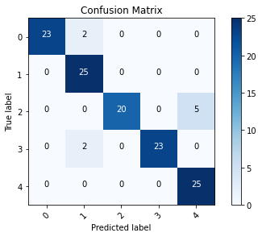

```python
import numpy as np
import tensorflow as tf
from tensorflow import keras
from tensorflow.keras.layers import Dense, Activation
from tensorflow.keras.optimizers import Adam
from tensorflow.keras.metrics import categorical_crossentropy
from tensorflow.keras.preprocessing.image import ImageDataGenerator
from tensorflow.keras.preprocessing import image
from tensorflow.keras.models import Model
from tensorflow.keras.applications import imagenet_utils
from sklearn.metrics import confusion_matrix
import itertools
import os
import shutil
import random
import matplotlib.pyplot as plt
%matplotlib inline
```

# Image preparation


```python
def plot_confusion_matrix(cm, classes,
                          normalize=False,
                          title='Confusion matrix',
                          cmap=plt.cm.Blues):
    """
    This function prints and plots the confusion matrix.
    Normalization can be applied by setting `normalize=True`.
    """
    plt.imshow(cm, interpolation='nearest', cmap=cmap)
    plt.title(title)
    plt.colorbar()
    tick_marks = np.arange(len(classes))
    plt.xticks(tick_marks, classes, rotation=45)
    plt.yticks(tick_marks, classes)

    if normalize:
        cm = cm.astype('float') / cm.sum(axis=1)[:, np.newaxis]
        print("Normalized confusion matrix")
    else:
        print('Confusion matrix, without normalization')

    print(cm)

    thresh = cm.max() / 2.
    for i, j in itertools.product(range(cm.shape[0]), range(cm.shape[1])):
        plt.text(j, i, cm[i, j],
            horizontalalignment="center",
            color="white" if cm[i, j] > thresh else "black")

    plt.tight_layout()
    plt.ylabel('True label')
    plt.xlabel('Predicted label')
```


```python
# Organize data into train, valid, test dirs
os.chdir('/Documents/data/flower-photos')

dirs = os.listdir()

if os.path.isdir('train/daisy/') is False: 
    os.mkdir('train')
    os.mkdir('valid')
    os.mkdir('test')
    
    for dir in dirs:
        if dir != 'train' and dir != 'test' and dir != 'valid':
            shutil.move(dir, 'train')
            os.mkdir(f'valid/{dir}')
            os.mkdir(f'test/{dir}')
              
            valid_samples = random.sample(os.listdir(f'train/{dir}'), 150)
            for j in valid_samples:
                shutil.move(f'train/{dir}/{j}', f'valid/{dir}')

            test_samples = random.sample(os.listdir(f'train/{dir}'), 25)
            for k in test_samples:
                shutil.move(f'train/{dir}/{k}', f'test/{dir}')
os.chdir('../..')
```

    daisy
    dandelion
    roses
    sunflowers
    tulips
    


```python
train_path = 'data/flower-photos/train'
valid_path = 'data/flower-photos/valid'
test_path = 'data/flower-photos/test'
```


```python
train_batches = ImageDataGenerator(preprocessing_function=tf.keras.applications.mobilenet.preprocess_input).flow_from_directory(
    directory=train_path, target_size=(224,224), batch_size=5)
valid_batches = ImageDataGenerator(preprocessing_function=tf.keras.applications.mobilenet.preprocess_input).flow_from_directory(
    directory=valid_path, target_size=(224,224), batch_size=5)
test_batches = ImageDataGenerator(preprocessing_function=tf.keras.applications.mobilenet.preprocess_input).flow_from_directory(
    directory=test_path, target_size=(224,224), batch_size=5, shuffle=False)
```

    Found 2795 images belonging to 5 classes.
    Found 750 images belonging to 5 classes.
    Found 125 images belonging to 5 classes.
    

# Modify model


```python
mobile = tf.keras.applications.mobilenet.MobileNet()
mobile.summary()
```

    Model: "mobilenet_1.00_224"
    _________________________________________________________________
    Layer (type)                 Output Shape              Param #   
    =================================================================
    input_2 (InputLayer)         [(None, 224, 224, 3)]     0         
    _________________________________________________________________
    conv1 (Conv2D)               (None, 112, 112, 32)      864       
    _________________________________________________________________
    conv1_bn (BatchNormalization (None, 112, 112, 32)      128       
    _________________________________________________________________
    conv1_relu (ReLU)            (None, 112, 112, 32)      0         
    _________________________________________________________________
    conv_dw_1 (DepthwiseConv2D)  (None, 112, 112, 32)      288       
    _________________________________________________________________
    conv_dw_1_bn (BatchNormaliza (None, 112, 112, 32)      128       
    _________________________________________________________________
    conv_dw_1_relu (ReLU)        (None, 112, 112, 32)      0         
    _________________________________________________________________
    conv_pw_1 (Conv2D)           (None, 112, 112, 64)      2048      
    _________________________________________________________________
    conv_pw_1_bn (BatchNormaliza (None, 112, 112, 64)      256       
    _________________________________________________________________
    conv_pw_1_relu (ReLU)        (None, 112, 112, 64)      0         
    _________________________________________________________________
    conv_pad_2 (ZeroPadding2D)   (None, 113, 113, 64)      0         
    _________________________________________________________________
    conv_dw_2 (DepthwiseConv2D)  (None, 56, 56, 64)        576       
    _________________________________________________________________
    conv_dw_2_bn (BatchNormaliza (None, 56, 56, 64)        256       
    _________________________________________________________________
    conv_dw_2_relu (ReLU)        (None, 56, 56, 64)        0         
    _________________________________________________________________
    conv_pw_2 (Conv2D)           (None, 56, 56, 128)       8192      
    _________________________________________________________________
    conv_pw_2_bn (BatchNormaliza (None, 56, 56, 128)       512       
    _________________________________________________________________
    conv_pw_2_relu (ReLU)        (None, 56, 56, 128)       0         
    _________________________________________________________________
    conv_dw_3 (DepthwiseConv2D)  (None, 56, 56, 128)       1152      
    _________________________________________________________________
    conv_dw_3_bn (BatchNormaliza (None, 56, 56, 128)       512       
    _________________________________________________________________
    conv_dw_3_relu (ReLU)        (None, 56, 56, 128)       0         
    _________________________________________________________________
    conv_pw_3 (Conv2D)           (None, 56, 56, 128)       16384     
    _________________________________________________________________
    conv_pw_3_bn (BatchNormaliza (None, 56, 56, 128)       512       
    _________________________________________________________________
    conv_pw_3_relu (ReLU)        (None, 56, 56, 128)       0         
    _________________________________________________________________
    conv_pad_4 (ZeroPadding2D)   (None, 57, 57, 128)       0         
    _________________________________________________________________
    conv_dw_4 (DepthwiseConv2D)  (None, 28, 28, 128)       1152      
    _________________________________________________________________
    conv_dw_4_bn (BatchNormaliza (None, 28, 28, 128)       512       
    _________________________________________________________________
    conv_dw_4_relu (ReLU)        (None, 28, 28, 128)       0         
    _________________________________________________________________
    conv_pw_4 (Conv2D)           (None, 28, 28, 256)       32768     
    _________________________________________________________________
    conv_pw_4_bn (BatchNormaliza (None, 28, 28, 256)       1024      
    _________________________________________________________________
    conv_pw_4_relu (ReLU)        (None, 28, 28, 256)       0         
    _________________________________________________________________
    conv_dw_5 (DepthwiseConv2D)  (None, 28, 28, 256)       2304      
    _________________________________________________________________
    conv_dw_5_bn (BatchNormaliza (None, 28, 28, 256)       1024      
    _________________________________________________________________
    conv_dw_5_relu (ReLU)        (None, 28, 28, 256)       0         
    _________________________________________________________________
    conv_pw_5 (Conv2D)           (None, 28, 28, 256)       65536     
    _________________________________________________________________
    conv_pw_5_bn (BatchNormaliza (None, 28, 28, 256)       1024      
    _________________________________________________________________
    conv_pw_5_relu (ReLU)        (None, 28, 28, 256)       0         
    _________________________________________________________________
    conv_pad_6 (ZeroPadding2D)   (None, 29, 29, 256)       0         
    _________________________________________________________________
    conv_dw_6 (DepthwiseConv2D)  (None, 14, 14, 256)       2304      
    _________________________________________________________________
    conv_dw_6_bn (BatchNormaliza (None, 14, 14, 256)       1024      
    _________________________________________________________________
    conv_dw_6_relu (ReLU)        (None, 14, 14, 256)       0         
    _________________________________________________________________
    conv_pw_6 (Conv2D)           (None, 14, 14, 512)       131072    
    _________________________________________________________________
    conv_pw_6_bn (BatchNormaliza (None, 14, 14, 512)       2048      
    _________________________________________________________________
    conv_pw_6_relu (ReLU)        (None, 14, 14, 512)       0         
    _________________________________________________________________
    conv_dw_7 (DepthwiseConv2D)  (None, 14, 14, 512)       4608      
    _________________________________________________________________
    conv_dw_7_bn (BatchNormaliza (None, 14, 14, 512)       2048      
    _________________________________________________________________
    conv_dw_7_relu (ReLU)        (None, 14, 14, 512)       0         
    _________________________________________________________________
    conv_pw_7 (Conv2D)           (None, 14, 14, 512)       262144    
    _________________________________________________________________
    conv_pw_7_bn (BatchNormaliza (None, 14, 14, 512)       2048      
    _________________________________________________________________
    conv_pw_7_relu (ReLU)        (None, 14, 14, 512)       0         
    _________________________________________________________________
    conv_dw_8 (DepthwiseConv2D)  (None, 14, 14, 512)       4608      
    _________________________________________________________________
    conv_dw_8_bn (BatchNormaliza (None, 14, 14, 512)       2048      
    _________________________________________________________________
    conv_dw_8_relu (ReLU)        (None, 14, 14, 512)       0         
    _________________________________________________________________
    conv_pw_8 (Conv2D)           (None, 14, 14, 512)       262144    
    _________________________________________________________________
    conv_pw_8_bn (BatchNormaliza (None, 14, 14, 512)       2048      
    _________________________________________________________________
    conv_pw_8_relu (ReLU)        (None, 14, 14, 512)       0         
    _________________________________________________________________
    conv_dw_9 (DepthwiseConv2D)  (None, 14, 14, 512)       4608      
    _________________________________________________________________
    conv_dw_9_bn (BatchNormaliza (None, 14, 14, 512)       2048      
    _________________________________________________________________
    conv_dw_9_relu (ReLU)        (None, 14, 14, 512)       0         
    _________________________________________________________________
    conv_pw_9 (Conv2D)           (None, 14, 14, 512)       262144    
    _________________________________________________________________
    conv_pw_9_bn (BatchNormaliza (None, 14, 14, 512)       2048      
    _________________________________________________________________
    conv_pw_9_relu (ReLU)        (None, 14, 14, 512)       0         
    _________________________________________________________________
    conv_dw_10 (DepthwiseConv2D) (None, 14, 14, 512)       4608      
    _________________________________________________________________
    conv_dw_10_bn (BatchNormaliz (None, 14, 14, 512)       2048      
    _________________________________________________________________
    conv_dw_10_relu (ReLU)       (None, 14, 14, 512)       0         
    _________________________________________________________________
    conv_pw_10 (Conv2D)          (None, 14, 14, 512)       262144    
    _________________________________________________________________
    conv_pw_10_bn (BatchNormaliz (None, 14, 14, 512)       2048      
    _________________________________________________________________
    conv_pw_10_relu (ReLU)       (None, 14, 14, 512)       0         
    _________________________________________________________________
    conv_dw_11 (DepthwiseConv2D) (None, 14, 14, 512)       4608      
    _________________________________________________________________
    conv_dw_11_bn (BatchNormaliz (None, 14, 14, 512)       2048      
    _________________________________________________________________
    conv_dw_11_relu (ReLU)       (None, 14, 14, 512)       0         
    _________________________________________________________________
    conv_pw_11 (Conv2D)          (None, 14, 14, 512)       262144    
    _________________________________________________________________
    conv_pw_11_bn (BatchNormaliz (None, 14, 14, 512)       2048      
    _________________________________________________________________
    conv_pw_11_relu (ReLU)       (None, 14, 14, 512)       0         
    _________________________________________________________________
    conv_pad_12 (ZeroPadding2D)  (None, 15, 15, 512)       0         
    _________________________________________________________________
    conv_dw_12 (DepthwiseConv2D) (None, 7, 7, 512)         4608      
    _________________________________________________________________
    conv_dw_12_bn (BatchNormaliz (None, 7, 7, 512)         2048      
    _________________________________________________________________
    conv_dw_12_relu (ReLU)       (None, 7, 7, 512)         0         
    _________________________________________________________________
    conv_pw_12 (Conv2D)          (None, 7, 7, 1024)        524288    
    _________________________________________________________________
    conv_pw_12_bn (BatchNormaliz (None, 7, 7, 1024)        4096      
    _________________________________________________________________
    conv_pw_12_relu (ReLU)       (None, 7, 7, 1024)        0         
    _________________________________________________________________
    conv_dw_13 (DepthwiseConv2D) (None, 7, 7, 1024)        9216      
    _________________________________________________________________
    conv_dw_13_bn (BatchNormaliz (None, 7, 7, 1024)        4096      
    _________________________________________________________________
    conv_dw_13_relu (ReLU)       (None, 7, 7, 1024)        0         
    _________________________________________________________________
    conv_pw_13 (Conv2D)          (None, 7, 7, 1024)        1048576   
    _________________________________________________________________
    conv_pw_13_bn (BatchNormaliz (None, 7, 7, 1024)        4096      
    _________________________________________________________________
    conv_pw_13_relu (ReLU)       (None, 7, 7, 1024)        0         
    _________________________________________________________________
    global_average_pooling2d_1 ( (None, 1024)              0         
    _________________________________________________________________
    reshape_1 (Reshape)          (None, 1, 1, 1024)        0         
    _________________________________________________________________
    dropout (Dropout)            (None, 1, 1, 1024)        0         
    _________________________________________________________________
    conv_preds (Conv2D)          (None, 1, 1, 1000)        1025000   
    _________________________________________________________________
    reshape_2 (Reshape)          (None, 1000)              0         
    _________________________________________________________________
    predictions (Activation)     (None, 1000)              0         
    =================================================================
    Total params: 4,253,864
    Trainable params: 4,231,976
    Non-trainable params: 21,888
    _________________________________________________________________
    


```python
x = mobile.layers[-6].output
output = Dense(units=5, activation='softmax')(x)
```


```python
model = Model(inputs=mobile.input, outputs=output)
```


```python
for layer in model.layers[:-23]:
    layer.trainable = False
```


```python
model.summary()
```

    Model: "model"
    _________________________________________________________________
    Layer (type)                 Output Shape              Param #   
    =================================================================
    input_2 (InputLayer)         [(None, 224, 224, 3)]     0         
    _________________________________________________________________
    conv1 (Conv2D)               (None, 112, 112, 32)      864       
    _________________________________________________________________
    conv1_bn (BatchNormalization (None, 112, 112, 32)      128       
    _________________________________________________________________
    conv1_relu (ReLU)            (None, 112, 112, 32)      0         
    _________________________________________________________________
    conv_dw_1 (DepthwiseConv2D)  (None, 112, 112, 32)      288       
    _________________________________________________________________
    conv_dw_1_bn (BatchNormaliza (None, 112, 112, 32)      128       
    _________________________________________________________________
    conv_dw_1_relu (ReLU)        (None, 112, 112, 32)      0         
    _________________________________________________________________
    conv_pw_1 (Conv2D)           (None, 112, 112, 64)      2048      
    _________________________________________________________________
    conv_pw_1_bn (BatchNormaliza (None, 112, 112, 64)      256       
    _________________________________________________________________
    conv_pw_1_relu (ReLU)        (None, 112, 112, 64)      0         
    _________________________________________________________________
    conv_pad_2 (ZeroPadding2D)   (None, 113, 113, 64)      0         
    _________________________________________________________________
    conv_dw_2 (DepthwiseConv2D)  (None, 56, 56, 64)        576       
    _________________________________________________________________
    conv_dw_2_bn (BatchNormaliza (None, 56, 56, 64)        256       
    _________________________________________________________________
    conv_dw_2_relu (ReLU)        (None, 56, 56, 64)        0         
    _________________________________________________________________
    conv_pw_2 (Conv2D)           (None, 56, 56, 128)       8192      
    _________________________________________________________________
    conv_pw_2_bn (BatchNormaliza (None, 56, 56, 128)       512       
    _________________________________________________________________
    conv_pw_2_relu (ReLU)        (None, 56, 56, 128)       0         
    _________________________________________________________________
    conv_dw_3 (DepthwiseConv2D)  (None, 56, 56, 128)       1152      
    _________________________________________________________________
    conv_dw_3_bn (BatchNormaliza (None, 56, 56, 128)       512       
    _________________________________________________________________
    conv_dw_3_relu (ReLU)        (None, 56, 56, 128)       0         
    _________________________________________________________________
    conv_pw_3 (Conv2D)           (None, 56, 56, 128)       16384     
    _________________________________________________________________
    conv_pw_3_bn (BatchNormaliza (None, 56, 56, 128)       512       
    _________________________________________________________________
    conv_pw_3_relu (ReLU)        (None, 56, 56, 128)       0         
    _________________________________________________________________
    conv_pad_4 (ZeroPadding2D)   (None, 57, 57, 128)       0         
    _________________________________________________________________
    conv_dw_4 (DepthwiseConv2D)  (None, 28, 28, 128)       1152      
    _________________________________________________________________
    conv_dw_4_bn (BatchNormaliza (None, 28, 28, 128)       512       
    _________________________________________________________________
    conv_dw_4_relu (ReLU)        (None, 28, 28, 128)       0         
    _________________________________________________________________
    conv_pw_4 (Conv2D)           (None, 28, 28, 256)       32768     
    _________________________________________________________________
    conv_pw_4_bn (BatchNormaliza (None, 28, 28, 256)       1024      
    _________________________________________________________________
    conv_pw_4_relu (ReLU)        (None, 28, 28, 256)       0         
    _________________________________________________________________
    conv_dw_5 (DepthwiseConv2D)  (None, 28, 28, 256)       2304      
    _________________________________________________________________
    conv_dw_5_bn (BatchNormaliza (None, 28, 28, 256)       1024      
    _________________________________________________________________
    conv_dw_5_relu (ReLU)        (None, 28, 28, 256)       0         
    _________________________________________________________________
    conv_pw_5 (Conv2D)           (None, 28, 28, 256)       65536     
    _________________________________________________________________
    conv_pw_5_bn (BatchNormaliza (None, 28, 28, 256)       1024      
    _________________________________________________________________
    conv_pw_5_relu (ReLU)        (None, 28, 28, 256)       0         
    _________________________________________________________________
    conv_pad_6 (ZeroPadding2D)   (None, 29, 29, 256)       0         
    _________________________________________________________________
    conv_dw_6 (DepthwiseConv2D)  (None, 14, 14, 256)       2304      
    _________________________________________________________________
    conv_dw_6_bn (BatchNormaliza (None, 14, 14, 256)       1024      
    _________________________________________________________________
    conv_dw_6_relu (ReLU)        (None, 14, 14, 256)       0         
    _________________________________________________________________
    conv_pw_6 (Conv2D)           (None, 14, 14, 512)       131072    
    _________________________________________________________________
    conv_pw_6_bn (BatchNormaliza (None, 14, 14, 512)       2048      
    _________________________________________________________________
    conv_pw_6_relu (ReLU)        (None, 14, 14, 512)       0         
    _________________________________________________________________
    conv_dw_7 (DepthwiseConv2D)  (None, 14, 14, 512)       4608      
    _________________________________________________________________
    conv_dw_7_bn (BatchNormaliza (None, 14, 14, 512)       2048      
    _________________________________________________________________
    conv_dw_7_relu (ReLU)        (None, 14, 14, 512)       0         
    _________________________________________________________________
    conv_pw_7 (Conv2D)           (None, 14, 14, 512)       262144    
    _________________________________________________________________
    conv_pw_7_bn (BatchNormaliza (None, 14, 14, 512)       2048      
    _________________________________________________________________
    conv_pw_7_relu (ReLU)        (None, 14, 14, 512)       0         
    _________________________________________________________________
    conv_dw_8 (DepthwiseConv2D)  (None, 14, 14, 512)       4608      
    _________________________________________________________________
    conv_dw_8_bn (BatchNormaliza (None, 14, 14, 512)       2048      
    _________________________________________________________________
    conv_dw_8_relu (ReLU)        (None, 14, 14, 512)       0         
    _________________________________________________________________
    conv_pw_8 (Conv2D)           (None, 14, 14, 512)       262144    
    _________________________________________________________________
    conv_pw_8_bn (BatchNormaliza (None, 14, 14, 512)       2048      
    _________________________________________________________________
    conv_pw_8_relu (ReLU)        (None, 14, 14, 512)       0         
    _________________________________________________________________
    conv_dw_9 (DepthwiseConv2D)  (None, 14, 14, 512)       4608      
    _________________________________________________________________
    conv_dw_9_bn (BatchNormaliza (None, 14, 14, 512)       2048      
    _________________________________________________________________
    conv_dw_9_relu (ReLU)        (None, 14, 14, 512)       0         
    _________________________________________________________________
    conv_pw_9 (Conv2D)           (None, 14, 14, 512)       262144    
    _________________________________________________________________
    conv_pw_9_bn (BatchNormaliza (None, 14, 14, 512)       2048      
    _________________________________________________________________
    conv_pw_9_relu (ReLU)        (None, 14, 14, 512)       0         
    _________________________________________________________________
    conv_dw_10 (DepthwiseConv2D) (None, 14, 14, 512)       4608      
    _________________________________________________________________
    conv_dw_10_bn (BatchNormaliz (None, 14, 14, 512)       2048      
    _________________________________________________________________
    conv_dw_10_relu (ReLU)       (None, 14, 14, 512)       0         
    _________________________________________________________________
    conv_pw_10 (Conv2D)          (None, 14, 14, 512)       262144    
    _________________________________________________________________
    conv_pw_10_bn (BatchNormaliz (None, 14, 14, 512)       2048      
    _________________________________________________________________
    conv_pw_10_relu (ReLU)       (None, 14, 14, 512)       0         
    _________________________________________________________________
    conv_dw_11 (DepthwiseConv2D) (None, 14, 14, 512)       4608      
    _________________________________________________________________
    conv_dw_11_bn (BatchNormaliz (None, 14, 14, 512)       2048      
    _________________________________________________________________
    conv_dw_11_relu (ReLU)       (None, 14, 14, 512)       0         
    _________________________________________________________________
    conv_pw_11 (Conv2D)          (None, 14, 14, 512)       262144    
    _________________________________________________________________
    conv_pw_11_bn (BatchNormaliz (None, 14, 14, 512)       2048      
    _________________________________________________________________
    conv_pw_11_relu (ReLU)       (None, 14, 14, 512)       0         
    _________________________________________________________________
    conv_pad_12 (ZeroPadding2D)  (None, 15, 15, 512)       0         
    _________________________________________________________________
    conv_dw_12 (DepthwiseConv2D) (None, 7, 7, 512)         4608      
    _________________________________________________________________
    conv_dw_12_bn (BatchNormaliz (None, 7, 7, 512)         2048      
    _________________________________________________________________
    conv_dw_12_relu (ReLU)       (None, 7, 7, 512)         0         
    _________________________________________________________________
    conv_pw_12 (Conv2D)          (None, 7, 7, 1024)        524288    
    _________________________________________________________________
    conv_pw_12_bn (BatchNormaliz (None, 7, 7, 1024)        4096      
    _________________________________________________________________
    conv_pw_12_relu (ReLU)       (None, 7, 7, 1024)        0         
    _________________________________________________________________
    conv_dw_13 (DepthwiseConv2D) (None, 7, 7, 1024)        9216      
    _________________________________________________________________
    conv_dw_13_bn (BatchNormaliz (None, 7, 7, 1024)        4096      
    _________________________________________________________________
    conv_dw_13_relu (ReLU)       (None, 7, 7, 1024)        0         
    _________________________________________________________________
    conv_pw_13 (Conv2D)          (None, 7, 7, 1024)        1048576   
    _________________________________________________________________
    conv_pw_13_bn (BatchNormaliz (None, 7, 7, 1024)        4096      
    _________________________________________________________________
    conv_pw_13_relu (ReLU)       (None, 7, 7, 1024)        0         
    _________________________________________________________________
    global_average_pooling2d_1 ( (None, 1024)              0         
    _________________________________________________________________
    dense (Dense)                (None, 5)                 5125      
    =================================================================
    Total params: 3,233,989
    Trainable params: 1,868,805
    Non-trainable params: 1,365,184
    _________________________________________________________________
    

# Train model


```python
model.compile(optimizer=Adam(lr=0.0001), loss='categorical_crossentropy', metrics=['accuracy']) 
```


```python
model.fit(x=train_batches,
            steps_per_epoch=len(train_batches),
            validation_data=valid_batches,
            validation_steps=len(valid_batches),
            epochs=30,
            verbose=2
)
```

    Epoch 1/30
    559/559 - 162s - loss: 0.6221 - accuracy: 0.7893 - val_loss: 0.3068 - val_accuracy: 0.9053
    Epoch 2/30
    559/559 - 143s - loss: 0.2951 - accuracy: 0.8916 - val_loss: 0.4816 - val_accuracy: 0.8440
    Epoch 3/30
    559/559 - 161s - loss: 0.2403 - accuracy: 0.9199 - val_loss: 0.3577 - val_accuracy: 0.8707
    Epoch 4/30
    559/559 - 148s - loss: 0.1743 - accuracy: 0.9406 - val_loss: 0.2717 - val_accuracy: 0.9120
    Epoch 5/30
    559/559 - 147s - loss: 0.1360 - accuracy: 0.9599 - val_loss: 0.4000 - val_accuracy: 0.8693
    Epoch 6/30
    559/559 - 139s - loss: 0.1056 - accuracy: 0.9689 - val_loss: 0.4403 - val_accuracy: 0.8667
    Epoch 7/30
    559/559 - 136s - loss: 0.1169 - accuracy: 0.9639 - val_loss: 0.3125 - val_accuracy: 0.9133
    Epoch 8/30
    559/559 - 137s - loss: 0.0696 - accuracy: 0.9789 - val_loss: 0.2813 - val_accuracy: 0.9093
    Epoch 9/30
    559/559 - 148s - loss: 0.0878 - accuracy: 0.9767 - val_loss: 0.2536 - val_accuracy: 0.9160
    Epoch 10/30
    559/559 - 143s - loss: 0.0695 - accuracy: 0.9782 - val_loss: 0.4437 - val_accuracy: 0.8800
    Epoch 11/30
    559/559 - 143s - loss: 0.0720 - accuracy: 0.9789 - val_loss: 0.5085 - val_accuracy: 0.8573
    Epoch 12/30
    559/559 - 166s - loss: 0.0674 - accuracy: 0.9800 - val_loss: 0.3698 - val_accuracy: 0.8960
    Epoch 13/30
    559/559 - 178s - loss: 0.0686 - accuracy: 0.9778 - val_loss: 0.4720 - val_accuracy: 0.8627
    Epoch 14/30
    559/559 - 202s - loss: 0.0414 - accuracy: 0.9871 - val_loss: 0.2904 - val_accuracy: 0.9267
    Epoch 15/30
    559/559 - 235s - loss: 0.0446 - accuracy: 0.9868 - val_loss: 0.2531 - val_accuracy: 0.9200
    Epoch 16/30
    559/559 - 196s - loss: 0.0493 - accuracy: 0.9835 - val_loss: 0.2262 - val_accuracy: 0.9267
    Epoch 17/30
    559/559 - 170s - loss: 0.0637 - accuracy: 0.9789 - val_loss: 0.2542 - val_accuracy: 0.9240
    Epoch 18/30
    559/559 - 154s - loss: 0.0461 - accuracy: 0.9893 - val_loss: 0.3785 - val_accuracy: 0.8973
    Epoch 19/30
    559/559 - 152s - loss: 0.0342 - accuracy: 0.9918 - val_loss: 0.2595 - val_accuracy: 0.9147
    Epoch 20/30
    559/559 - 153s - loss: 0.0403 - accuracy: 0.9875 - val_loss: 0.4160 - val_accuracy: 0.8867
    Epoch 21/30
    559/559 - 151s - loss: 0.0359 - accuracy: 0.9900 - val_loss: 0.3335 - val_accuracy: 0.9067
    Epoch 22/30
    559/559 - 164s - loss: 0.0276 - accuracy: 0.9921 - val_loss: 0.3025 - val_accuracy: 0.9133
    Epoch 23/30
    559/559 - 172s - loss: 0.0327 - accuracy: 0.9911 - val_loss: 0.2969 - val_accuracy: 0.9107
    Epoch 24/30
    559/559 - 157s - loss: 0.0249 - accuracy: 0.9932 - val_loss: 0.4013 - val_accuracy: 0.9160
    Epoch 25/30
    559/559 - 153s - loss: 0.0441 - accuracy: 0.9889 - val_loss: 0.3204 - val_accuracy: 0.9160
    Epoch 26/30
    559/559 - 155s - loss: 0.0288 - accuracy: 0.9911 - val_loss: 0.3413 - val_accuracy: 0.9080
    Epoch 27/30
    559/559 - 156s - loss: 0.0193 - accuracy: 0.9950 - val_loss: 0.2357 - val_accuracy: 0.9387
    Epoch 28/30
    559/559 - 194s - loss: 0.0200 - accuracy: 0.9943 - val_loss: 0.2936 - val_accuracy: 0.9160
    Epoch 29/30
    559/559 - 178s - loss: 0.0224 - accuracy: 0.9946 - val_loss: 0.3062 - val_accuracy: 0.9187
    Epoch 30/30
    559/559 - 172s - loss: 0.0171 - accuracy: 0.9950 - val_loss: 0.3157 - val_accuracy: 0.9133
    


    <tensorflow.python.keras.callbacks.History at 0x1ecfea2e820>


# Prediction


```python
test_labels = test_batches.classes
```


```python
predictions = model.predict(x=test_batches, steps=len(test_batches), verbose=0)
```


```python
cm = confusion_matrix(y_true=test_labels, y_pred=predictions.argmax(axis=1))
```


```python
test_batches.class_indices
```


    {'daisy': 0, 'dandelion': 1, 'roses': 2, 'sunflowers': 3, 'tulips': 4}


```python
cm_plot_labels = ['0','1','2','3','4']
plot_confusion_matrix(cm=cm, classes=cm_plot_labels, title='Confusion Matrix')
```

    Confusion matrix, without normalization
    [[23  2  0  0  0]
     [ 0 25  0  0  0]
     [ 0  0 20  0  5]
     [ 0  2  0 23  0]
     [ 0  0  0  0 25]]
    


    

    

